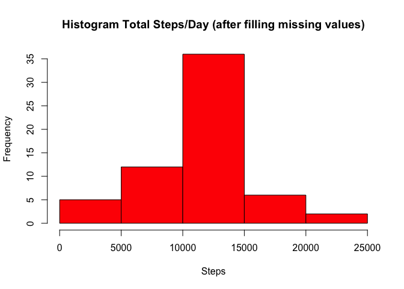

# Reproducible Research: Peer Assessment 1


## Loading and preprocessing the data
- Load the data 

```r
# The assumption is that the required data (activity.zip) is present in the 
# working directory.
unzip("activity.zip")
activity <- read.csv("activity.csv")
```
- Process/transform the data into a format suitable for your analysis

```r
good <- complete.cases(activity)
activity_full_data <- activity[good, ]
# Process the data to get the plots we want
steps_date <- aggregate(steps ~ date, activity_full_data, sum)
summary(steps_date)
```

```
##          date        steps      
##  2012-10-02: 1   Min.   :   41  
##  2012-10-03: 1   1st Qu.: 8841  
##  2012-10-04: 1   Median :10765  
##  2012-10-05: 1   Mean   :10766  
##  2012-10-06: 1   3rd Qu.:13294  
##  2012-10-07: 1   Max.   :21194  
##  (Other)   :47
```

## What is mean total number of steps taken per day?
- Histogram of the total number of steps taken each day

```r
hist(steps_date$steps, col = "red", main = "Total Steps Per Day", 
                xlab = "Steps")
```

 

- Calculate and report the mean and median total number of steps taken per day

```r
steps_mean <- mean(steps_date$steps)
steps_median <- median(steps_date$steps)
```
- Mean total number of steps taken per day is:

```r
steps_mean
```

```
## [1] 10766
```
- Median of total number of steps taken per day is:

```r
steps_median
```

```
## [1] 10765
```

## What is the average daily activity pattern?
- Time series plot (i.e. type = "l") of the 5-minute interval (x-axis) and the 
average number of steps taken, averaged across all days (y-axis)

```r
plot_data <- aggregate(steps ~ interval, activity_full_data, mean)
plot(plot_data$interval, plot_data$steps, type = "l", xlab = "inteval",
    ylab = "Average Steps", main="Time Series plot of interval, average steps")
```

 

- The 5-minute interval, on average across all the days in the dataset that 
contains the maximum number of steps is: 

```r
plot_data[(plot_data$steps == max(plot_data$steps)), ]$interval
```

```
## [1] 835
```

## Imputing missing values
- The total number of missing values in the dataset

```r
nrow(activity[!good, ])
```

```
## [1] 2304
```

Using the mean for 5-minute intervals for filling in all of the missing values 
in the dataset

```r
missing_value_entries <- activity[!good, ]
fill_missing_values <- merge(missing_value_entries, plot_data, 
                                by.x="interval", by.y="interval", all.x = TRUE)
fill_missing_values$steps.x <- fill_missing_values$steps.y
fill_missing_values <- fill_missing_values[c("steps.x", "date","interval")]
```

- Create a new dataset that is equal to the original dataset but with the 
missing data filled in

```r
full_data <- merge(activity, fill_missing_values, by.x=c("interval", "date"), 
                    by.y=c("interval", "date"), all.x=TRUE)
full_data[is.na(full_data$steps), ]$steps <- 
                        full_data[!is.na(full_data$steps.x), ]$steps.x
full_data <- full_data[c("steps", "date","interval")]
nrow(full_data[is.na(full_data$steps), ])
```

```
## [1] 0
```

- Make a histogram of the total number of steps taken each day and Calculate and 
report the mean and median total number of steps taken per day

```r
steps_date <- aggregate(steps ~ date, full_data, sum)
hist(steps_date$steps, col = "red", 
            main = "Histogram Total Steps/Day (after filling missing values)",
            xlab = "Steps")
```

 

- Mean =>

```r
mean(steps_date$steps)
```

```
## [1] 10766
```

- Median =>

```r
median(steps_date$steps)
```

```
## [1] 10766
```

- These new mean value does not differ from the estimates 
from the first part of the assignment at all. And that makes sense because we
filled in the missing values with the median value of that interval. 
- There is a slight change in the median value and that is probably because of 
the placements of the NA values in the origin dataset.

## Are there differences in activity patterns between weekdays and weekends?
- Create a new factor variable in the dataset with two levels “weekday” and 
“weekend” indicating whether a given date is a weekday or weekend day

```r
full_data$weekdays <- weekdays(as.Date(full_data$date, format="%Y-%m-%d"))
full_data$weekdays <- ifelse(full_data$weekdays == "Saturday" | 
                        full_data$weekdays == "Sunday", "weekend", "weekday")
full_data$weekdays <- as.factor(full_data$weekdays)
class(full_data$weekdays)
```

```
## [1] "factor"
```

- Make a panel plot containing a time series plot (i.e. type = "l") of the 
5-minute interval (x-axis) and the average number of steps taken, 
averaged across all weekday days or weekend days (y-axis).

```r
plot_data <- aggregate(steps ~ interval + weekdays, full_data, mean)
library(lattice)
xyplot(steps ~ interval | factor(weekdays), plot_data, aspect = 1/2, type = "l")
```

 
